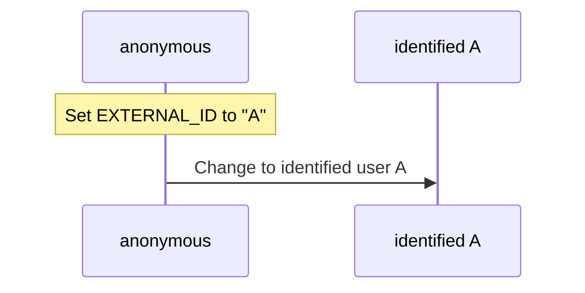
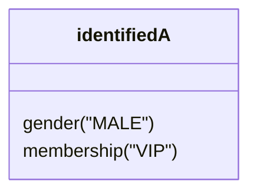
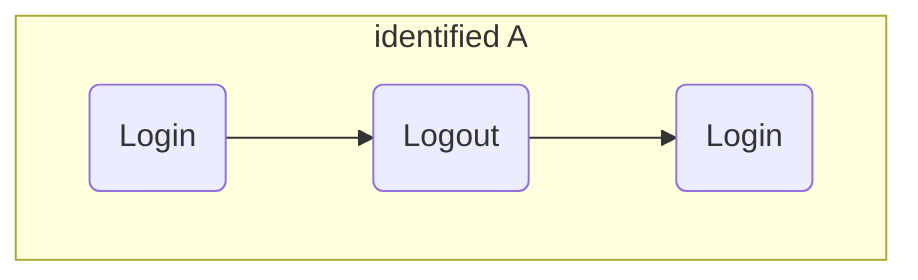
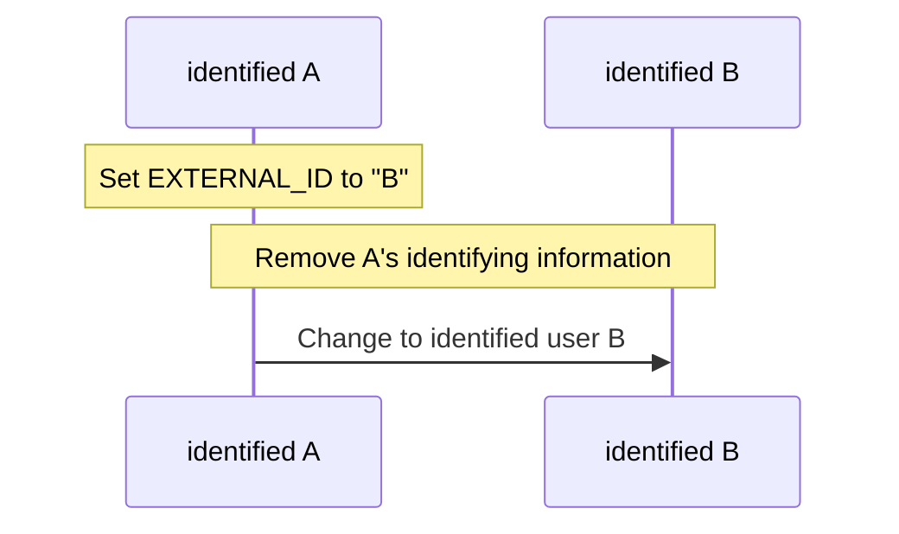
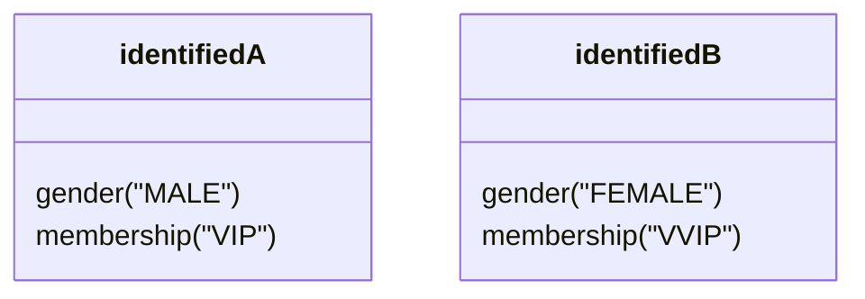
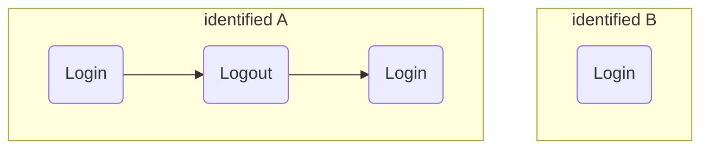

# 🎬 Unified ID linking scenario

Setting up a user profile This document uses a hypothetical scenario as an example to help you understand the configuration of user information and device connection by setting unified ID identification information.

## Initial installation of app

To initialize the SDK, you must follow the steps specified in the [Quick Start](./integration.md) guide.

## Login

This section shows the transition from [anonymous user profile](#anonymous-user-profile) state to [identified user profile](#identified-user-profile).

### 1. Setting Unified ID

Before recording the login event, set the `EXTERNAL_ID` value, which is the value to identify the user, [in Unified ID identification](./identity.md). Through this process, the user switches from [Anonymous User Profile](#Anonymous-User-Profile) to [Identified User Profile](#Identified-User-Profile) and a unified ID is created so that the user can use it on any platform. This user can be identified through the unified ID.

```java
DfineryProperties.setIdentity(DF.Identity.EXTERNAL_ID, "A")
//You can increase the accuracy of user identification by additionally setting other identification.
DfineryProperties.setIdentity(DF.Identity.EMAIL, "A@igaworks.com")
DfineryProperties.setIdentity(DF.Identity.PHONE_NO, "8201012345678")
...
```



### 2. Setting up user profile
If there is information that needs to be set for identified User A, set it through [User Profile Settings](./user_profile.md).

> [!TIP]
> User profiles can be set by setting custom key values in the console.

```java
DfineryProperties.setUserProfile(DF.UserProfile.GENDER, DF.Gender.MALE)
DfineryProperties.setUserProfile(DF.UserProfile.MEMBERSHIP, "VIP")
...
```



### 3. Logging login events
Log [login](./analytics.md) event. 

```java
Dfinery.getInstance().logEvent(DF.Event.LOGIN)
```

## User logout

This section shows the process of logging out of identified user A.

### 1. Logging logout event

Log [logout](./analytics.md) event. 

```java
Dfinery.getInstance().logEvent(DF.Event.LOGOUT)
```

### 2. Disconnecting the unified ID from the device

If you do not want actions to be targeted to identified user A after he or she logs out, disconnect by calling the `suspendUserTargeting()` API.

> [!WARNING]
> If you want to receive personalized messages even after logging out and exiting, you should not call the `suspendUserTargeting()` API.

```java
Dfinery.getInstance().suspendUserTargeting()
```

Afterwards, no actions will be targeted to the identified user A on that device. However, since device can be targeted, actions for all targets or messages targeting the device will be received.

 ## Login using the previously used `EXTERNAL_ID`
  This section shows how a user who has previously set up unified ID can log in again using the same `EXTERNAL_ID` value.

 ### 1. Setting Unified ID
  If the entered `EXTERNAL_ID` value is the same as before, the device will be connected again to the previously created identified user A.

 ```java
DfineryProperties.setIdentity(DF.Identity.EXTERNAL_ID, "A")
```

 ### 2. Logging login events
  The flow of events also continues as before for the identified user A.

```java
Dfinery.getInstance().logEvent(DF.Event.LOGIN)
```


## Login using `EXTERNAL_ID` different from the previously used value
This section shows the process by which a user who has a history of setting unified ID logs in using an `EXTERNAL_ID` value that is different from the value previously used.

### 1. Setting Unified ID
  If the entered `EXTERNAL_ID` value is different from the previous one, the SDK determines that it is a different user, deletes all previously stored integrated ID information, sets a new one, and the device is connected to the identified user B.

 ```java
DfineryProperties.setIdentity(DF.Identity.EXTERNAL_ID, "B")
```



### 2. Setting up user profile
A user profile is set up for identified user B.

```java
DfineryProperties.setUserProfile(DF.UserProfile.GENDER, DF.Gender.FEMALE)
DfineryProperties.setUserProfile(DF.UserProfile.MEMBERSHIP, "VVIP")
...
```


 ### 3. Logging login events
 The flow of events changes to that of the newly identified user B.

```java
Dfinery.getInstance().logEvent(DF.Event.LOGIN)
```


---

## Terms

### Anonymous user profile
If you do not set any user identification information, you will be treated as an anonymous user. For example, this could be a user who visited your website but didn't sign up, or who downloaded your mobile app but didn't create a profile.

When a user is initially recognized by the SDK, they are issued a unique identifier generated by the SDK, creating an anonymous user profile.

### Identified user profile
If you set the `DF.Identity.EXTERNAL_ID` value for any of the identity types below, you will be treated as an identified user in Dfinery and will be able to identify the same user profile across multiple devices. Additionally, you can set additional information such as user email and phone number for clearer user identification.