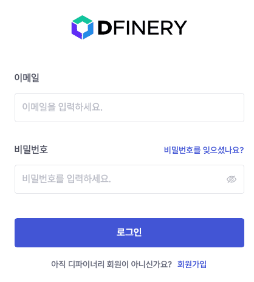
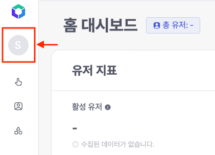
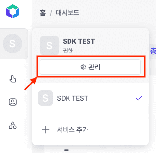
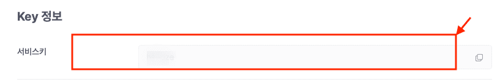

# 👋 Quick start

This article covers how to integrate the Dfinery Android SDK into Android. When you install the Dfinery SDK, event analysis, user profile, and action are provided.

## Integrating SDK

### Adding dependencies
To apply dependencies from the Dfinery SDK in your app, complete the following steps:
 
#### 1. Add `mavenCentral` within repositories to import maven dependencies.

<details open>
  <summary>build.gradle (Gradle 3.5 이전)</summary>

```
allprojects {
    repositories {
        mavenCentral()
    }
}
```
</details>
<details open>
  <summary>settings.gradle (Gradle 3.5 이후)</summary>

```
pluginManagement {
    repositories {
        mavenCentral()
    }
}
dependencyResolutionManagement {
    repositories {
        mavenCentral()
    }
}
```

</details>

#### 2. Open the `build.gradle` file within the app's module directory.
#### 3. Add [latest version of Dfinery SDK](https://github.com/IGAWorksDev/dfinery-android-sdk/releases) and SDK dependencies for required elements in dependencies.

> [!NOTE]
> Dfinery requires the [play-services-appset](https://developer.android.com/training/articles/app-set-id) dependency to collect the AppSetId.

```
 dependencies {
  implementation 'com.google.android.gms:play-services-appset:16.0.2'
  //Get the latest version from https://mvnrepository.com/artifact/com.igaworks.dfinery/android-sdk
  implementation 'com.igaworks.dfinery:android-sdk:HERE_LATEST_VERSION'
  //Fore example
  //implementation 'com.igaworks.dfinery:android-sdk:1.0.0'
}
```

### Initialization
To initialize the Dfinery SDK in your app, complete the following steps:

#### 1. Create an object that extends Application. If an object already exists, that object is used.

<details open>
  <summary>Java</summary>

```java
public class BaseApplication extends Application
```

</details>

<details open>
  <summary>Kotlin</summary>

```kotlin
class BaseApplication: Application()
```

</details>

#### 2. Override the [onCreate()](https://developer.android.com/reference/android/app/Application#onCreate()) method in the object that inherits Application.

<details open>
  <summary>Java</summary>

```java
@Override
public void onCreate() {
    super.onCreate();
}
```

</details>

<details open>
  <summary>Kotlin</summary>

```kotlin
override fun onCreate() {
    super.onCreate()
}
```

</details>

#### 3. Write the following code within the onCreate() method.

> Service ID can be checked in the `Service Management/Service Information/Key Information/Service Key` path of [Dfinery Console](https://console.dfinery.ai/). Please refer to this [section](#get-service-id) for additional information.

```java
Dfinery.getInstance().init(this, "{your_service_id}")
```
The following code snippet shows an example when initialization is complete:

<details open>
  <summary>Java</summary>


```java
public class BaseApplication extends Application{
    @Override
    public void onCreate() {
        super.onCreate();
        Dfinery.getInstance().init(this, "{your_service_id}");
    }
}
```

</details>

<details open>
  <summary>Kotlin</summary>

```kotlin
class BaseApplication: Application(){
    override fun onCreate() {
        super.onCreate()
        Dfinery.getInstance().init(this, "{your_service_id}")
    }
}
```
</details>

#### 4. Register the created application in AndroidManifest.xml.

```xml
<?xml version="1.0" encoding="utf-8"?>
<manifest xmlns:android="http://schemas.android.com/apk/res/android">
    <application
        android:name=".BaseApplication">
    </application>
</manifest>
```

#### 5. Add the required permissions to AndroidManifest.xml.
```xml
<uses-permission android:name="android.permission.INTERNET" />
<uses-permission android:name="android.permission.ACCESS_NETWORK_STATE" />
```

### Set up Google Advertising ID (optional)
To collect Google Advertising ID, you must set it manually through the `setGoogleAdvertisingId()` method.

#### 1. Open the `build.gradle` file within the app’s module directory.
#### 2. Add [dependencies required to collect advertising ID](https://developers.google.com/android/guides/setup) to dependencies.

```java
 dependencies {
  implementation 'com.google.android.gms:play-services-ads-identifier:18.0.1'
}
```

#### 3. Add the required permissions to AndroidManifest.xml.
```xml
<uses-permission android:name="com.google.android.gms.permission.AD_ID" />
```

#### 4. Set the advertising ID through the `setGoogleAdvertisingId()` method.

> [!TIP]
> Advertising ID collection logic should not run on the main thread. The code snippet below operates by creating a Thread, but other methods (AsyncTask, coroutine, etc.) can be used.


<details open>
  <summary>Java</summary>


```java
new Thread(new Runnable() {
    @Override
    public void run() {
        try {
            AdvertisingIdClient.Info idInfo = AdvertisingIdClient.getAdvertisingIdInfo(getApplicationContext());
            DfineryProperties.setGoogleAdvertisingId(idInfo.getId(), idInfo.isLimitAdTrackingEnabled());
        } catch (Exception e) {
            e.printStackTrace();
        }
    }
}).start();
```

</details>

<details open>
  <summary>Kotlin</summary>

```kotlin
Thread {
    try {
        val idInfo = AdvertisingIdClient.getAdvertisingIdInfo(
            applicationContext
        )
        DfineryProperties.setGoogleAdvertisingId(idInfo.id, idInfo.isLimitAdTrackingEnabled)
    } catch (e: Exception) {
        e.printStackTrace()
    }
}.start()
```
</details>

### Complete.
Initialization of Dfinery is now complete.

## Find out More

### Get Service ID

#### 1. Go to the [Dfinery Console](https://console.dfinery.ai/) webpage.
#### 2. Enter your email address and password to log in.

#### 3. Click the service icon in the upper left corner to activate the screen.

#### 4. Click the Management button to enter the service information page.합니다.

#### 4. Get the service ID from the key information at the bottom.
