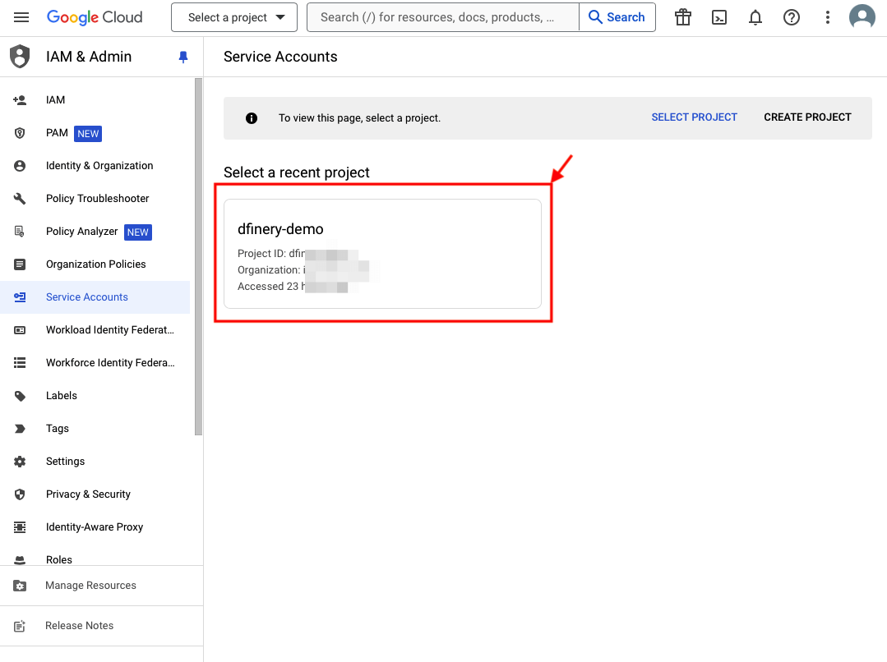
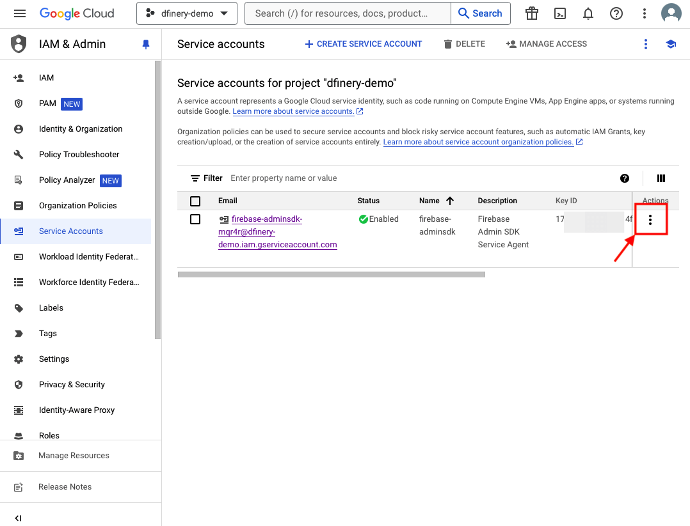
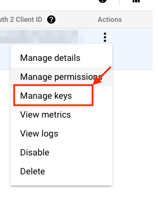
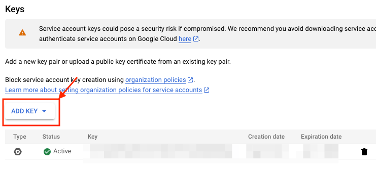
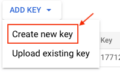
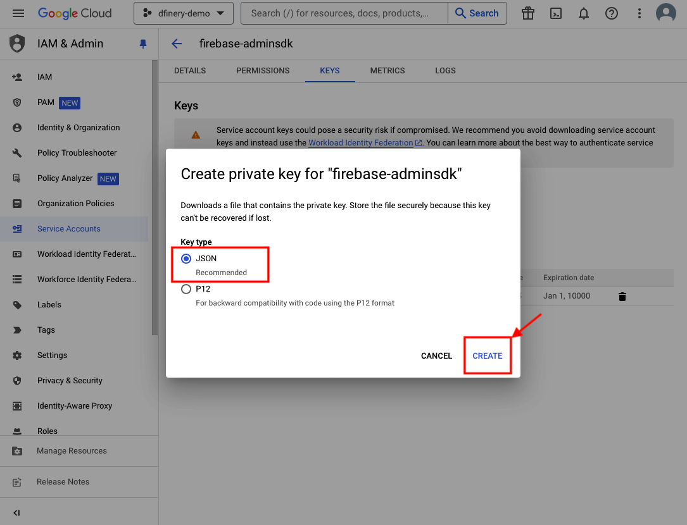

# 🔔 푸시 알림

Dfinery는 Firebase Cloud Messaging을 사용하여 푸시를 수신받으므로 어플리케이션에서 Firebase 연동이 필요합니다.

## Android 프로젝트에 Firebase 추가하기
Firebase에서 제공되는 [Android 프로젝트에 Firebase 추가](https://firebase.google.com/docs/android/setup?hl=ko#next_steps) 의 지시사항에 따라 Android 프로젝트에 Firebase를 추가합니다.

## Dfinery Console에서 Firebase 정보 등록하기
Console에서 [부가설정/채널 부가 설정/푸시/Android 설정관리](https://console.dfinery.ai)에 들어가 발신자 ID를 입력하고 JSON 형식의 Firebase 사용자 인증 정보 비공개 키 파일을 업로드합니다.

### 발신자 ID 확인 방법

#### 1. [Firebase Console](https://console.firebase.google.com/)로 이동합니다.
#### 2. 프로젝트를 선택합니다.
#### 3. 좌측 패널에서 프로젝트 개요 오른쪽에 ⚙️ 아이콘을 클릭합니다.
#### 4. 프로젝트 설정을 클릭합니다.
#### 5. 프로젝트 설정 상단 탭에서 클라우드 메시징을 클릭합니다.
#### 6. [발신자 ID](https://firebase.google.com/docs/cloud-messaging/concept-options?hl=ko#senderid)를 확인합니다.

### Firebase 사용자 인증 정보 비공개 키 파일 발급 방법

Firebase에서 제공하는 [수동으로 사용자 인증 정보 제공](https://firebase.google.com/docs/cloud-messaging/auth-server?hl=ko#provide-credentials-manually)을 참고하여 JSON 형식으로 키를 저장한다음 Console에 파일을 업로드 해주세요.

해당 페이지에서 확인할 수 있는 주요 내용은 다음과 같습니다.
> 1. [Firebase Console](https://console.firebase.google.com/)에서 설정 > [서비스 계정](https://console.cloud.google.com/iam-admin/)을 엽니다.
> 2. 새 비공개 키 생성을 클릭한 다음 키 생성을 클릭하여 확인합니다.
> 3. 키가 들어 있는 JSON 파일을 안전하게 저장합니다.

만약 비공개 키 파일 발급에 어려움을 겪으실 경우 [Firebase 사용자 인증 정보 비공개 키 파일 발급 따라해보기](#firebase-사용자-인증-정보-비공개-키-파일-발급-따라해보기)를 참고하여 주시기 바랍니다.

## Firebase Cloud Messaging 설정하기
Firebase에서 제공되는 [Android에서 Firebase 클라우드 메시징 클라이언트 앱 설정](https://firebase.google.com/docs/cloud-messaging/android/client?hl=ko) 의 지시사항에 따라 다음의 항목을 적용합니다.
- [앱 매니페스트에 FirebaseMessagingService를 상속받는 서비스 추가](https://firebase.google.com/docs/cloud-messaging/android/client?hl=ko#manifest)
- [Android 13 이상에서 적용되는 런타임 알림 권한 요청 작성](https://firebase.google.com/docs/cloud-messaging/android/client?hl=ko#request-permission13)
- [기기 등록 토큰 액세스 연동](https://firebase.google.com/docs/cloud-messaging/android/client?hl=ko#sample-register)

## Support Library 의존성 추가하기
Dfinery는 푸시 알림을 작성하는데 [Support Library](https://developer.android.com/jetpack/androidx/releases/core?hl=ko)를 필요로 하므로 다음의 일련의 단계를 완료하세요.
### 1. 앱의 모듈 디렉터리 내에 있는 `build.gradle` 파일을 엽니다.
### 2. dependencies에 Support Library 의존성을 추가합니다.

```
 dependencies {
    implementation 'androidx.core:core:1.9.0'
}
```

## 토큰을 Dfinery에 연동하기
Firebase에서 발급된 토큰을 Dfinery에 연동하기 위해서 다음과 같이 작성해주시기 바랍니다.
### 현재 등록 토큰 가져오기 시 연동

> [!TIP]
> 토큰은 자주 변경되지 않으므로 코드가 자주 불리지 않도록 Application을 상속받은 객체의 [onCreate()](https://developer.android.com/reference/android/app/Application#onCreate()) 메소드에 작성하시는 것을 권장드립니다. 

<details open>
  <summary>Java</summary>

```java
FirebaseMessaging.getInstance().getToken().addOnCompleteListener(new OnCompleteListener<String>() {
    @Override
    public void onComplete(@NonNull Task<String> task) {
        if (!task.isSuccessful()) {
            Log.w(TAG, "Fetching FCM registration token failed", task.getException());
            return;
        }

        // Get new FCM registration token
        String token = task.getResult();
        DfineryProperties.setPushToken(token);
    }
});
```

</details>

<details open>
  <summary>Kotlin</summary>

```kotlin
FirebaseMessaging.getInstance().token.addOnCompleteListener(OnCompleteListener { task ->
    if (!task.isSuccessful) {
        Log.w(TAG, "Fetching FCM registration token failed", task.exception)
        return@OnCompleteListener
    }

    // Get new FCM registration token
    val token = task.result
    DfineryProperties.setPushToken(token)
})
```

</details>

### 토큰 생성 모니터링 시 연동
FirebaseMessagingService를 상속받은 클래스에서 [onNewToken(String)](https://firebase.google.com/docs/reference/android/com/google/firebase/messaging/FirebaseMessagingService#onNewToken(java.lang.String)) 메소드를 Override 하여 토큰을 Dfinery에 등록합니다.

<details open>
  <summary>Java</summary>

```java
@Override
public void onNewToken(@NonNull String token) {
    Log.d(TAG, "Refreshed token: " + token);
    DfineryProperties.setPushToken(token);
}
```

</details>

<details open>
  <summary>Kotlin</summary>

```kotlin
override fun onNewToken(token: String) {
    Log.d(TAG, "Refreshed token: $token")
    DfineryProperties.setPushToken(token)
}
```

</details>

## 푸시 알림 채널을 Dfinery에 연동하기
### 푸시 알림 채널 생성
Android 8.0부터는 알림을 수신받기 위해 알림 채널 생성이 필요합니다. Android에서 제공하는 [알림 채널 만들기 및 관리](https://developer.android.com/training/notify-user/channels?hl=ko)의 지시사항과 [알림 채널 생성 따라해보기](#알림-채널-생성-따라해보기)를 참고하여 알림 채널을 생성해주시기 바랍니다.

> [!WARNING]
> 한번 생성된 알림 채널에 대한 설정 정보는 이름과 설명등의 정보를 제외하고는 코드를 통해 설정 값이 변경되지 않습니다. 또한 알림 채널에 대한 설정 정보는 사용자에 의해 변경될 수 있으므로 유의 바랍니다. 

### 생성한 푸시 알림 채널 ID 등록
DfineryConfig의 `setDefaultNotificationChannelId()` 메소드를 사용하여 생성한 알림 채널의 ID를 등록합니다.

<details open>
  <summary>Java</summary>

```java
DfineryConfig config = new DfineryConfig.Builder()
    .setDefaultNotificationChannelId("{your_notification_channel_id}")
    .build();
Dfinery.getInstance().init(this, "{your_application_key}", config);
```

</details>

<details open>
  <summary>Kotlin</summary>

```kotlin
val config = DfineryConfig.Builder()
    .setDefaultNotificationChannelId("{your_notification_channel_id}")
    .build()
Dfinery.getInstance().init(this, "{your_application_key}", config)
```

</details>

## 푸시 알림 아이콘 설정하기
푸시 알림을 표시하기 위해서는 아이콘 설정이 필요합니다. DfineryConfig의 `setNotificationIconResourceId()` 메소드를 사용하여 아이콘을 설정해주시기 바랍니다.

> [!TIP]
> 알림 자체는 물론 상단 상태 표시줄에도 표시되는 아이콘이기 때문에 이미지의 색상이 무시되니 72x72px의 투명색(알파채널)을 가진 이미지를 권장합니다.

<details open>
  <summary>Java</summary>

```java
DfineryConfig config = new DfineryConfig.Builder()
    .setNotificationIconResourceId(R.drawable.icon)
    .build();
Dfinery.getInstance().init(this, "{your_application_key}", config);
```

</details>

<details open>
  <summary>Kotlin</summary>

```kotlin
val config = DfineryConfig.Builder()
    .setNotificationIconResourceId(R.drawable.icon)
    .build()
Dfinery.getInstance().init(this, "{your_application_key}", config)
```

</details>

## 푸시 알림 수신 처리하기
푸시가 수신되면 FirebaseMessagingService를 상속받은 객체에 푸시 수신 이벤트가 발생합니다. Dfinery는 수신된 푸시 페이로드를 토대로 알림을 생성하므로 해당 객체의 [onMessageReceived(RemoteMessage)](https://firebase.google.com/docs/reference/android/com/google/firebase/messaging/FirebaseMessagingService#onMessageReceived(com.google.firebase.messaging.RemoteMessage)) 소드 내에 다음과 같이 작성하여 주시기 바랍니다.

<details open>
  <summary>Java</summary>

```java
@Override
public void onMessageReceived(@NonNull RemoteMessage remoteMessage) {
    super.onMessageReceived(remoteMessage);
    if(Dfinery.getInstance().handleRemoteMessage(getApplicationContext(), remoteMessage)){
        //dfinery push
    }else{
        //This is not a push notification sent from Dfinery.
    }
}
```

</details>

<details open>
  <summary>Kotlin</summary>

```kotlin
override fun onMessageReceived(remoteMessage: RemoteMessage) {
  if(Dfinery.getInstance().handleRemoteMessage(applicationContext, remoteMessage)){
        //dfinery push
    }else{
        //This is not a push notification sent from Dfinery.
    }
}
```

</details>

## 푸시 알림 클릭 처리하기
푸시를 클릭할 경우 딥링크에 설정된 Activity가 실행되거나 딥링크가 없을 경우 `android.intent.action.MAIN` 액션을 가지고 있는 Activity가 실행됩니다. 

클릭한 푸시 데이터는 해당하는 Activity의 `onCreate(Bundle)` 메소드로 전달됩니다.
클릭한 데이터를 활용하고 싶으실 경우 이곳에서 `getDfineryPushNotification()`를 사용하여 푸시 데이터가 담겨있는 [PushNotification](#pushpayload-알아보기) 객체를 가져올 수 있습니다.

> [!WARNING]
> 데이터 파싱에 실패하거나 Intent에 푸시 데이터가 없을 경우 null이 반환되므로 반드시 null 체크를 해주시기 바랍니다.

<details open>
  <summary>Java</summary>

```java
@Override
protected void onCreate(Bundle savedInstanceState) {
    super.onCreate(savedInstanceState);
    PushNotification pushNotification = Dfinery.getInstance().getDfineryPushNotification(getIntent());
    if(pushNotification != null){
        String title = pushNotification.getTitle();
    }
}
```

</details>

<details open>
  <summary>Kotlin</summary>

```kotlin
override fun onCreate(savedInstanceState: Bundle?) {
    super.onCreate(savedInstanceState)
    val pushNotification = Dfinery.getInstance().getDfineryPushNotification(intent)
    pushNotification?.let { 
        it.title
    }
}
```
</details>

## 푸시 알림 수신 허용 유무 반영하기
광고성 목적이 있는 푸시의 경우 [정보통신망법](https://www.law.go.kr/법령/정보통신망%20이용촉진%20및%20정보보호%20등에%20관한%20법률/제50조#:~:text=제50조) 에 따라 사용자에게 사전 수신동의를 받아야 합니다. 사용자에게 푸시 알림이 허용되었다는 정보를 Dfinery에 반영하기 위해서 다음의 일련의 작업을 수행하여 주시기 바랍니다.

### 1. 사용자에게 푸시 알림 허용에 대한 고지하기
### 2. 사용자의 허용/거부 의사에 대한 값을 반영하기 위해 다음의 코드를 작성

[알림 수신 동의 설정하기](./user_profile.md#알림-수신-동의-정보-설정하기)를 참고하여 사용자가 동의한 항목에 대해 값을 입력해주시기 바랍니다. 아래 코드는 푸시 채널에 관해 정보성, 광고성 수신 동의를 허용한 예시입니다.

<details open>
<summary>Java</summary>

```java
Map<String, Object> consents = new HashMap<>();
consents.put(DF.UserProfile.INFORMATIONAL_NOTIFICATION_FOR_PUSH_CHANNEL, true);
consents.put(DF.UserProfile.ADVERTISING_NOTIFICATION_FOR_PUSH_CHANNEL, true);
DfineryProperties.setUserProfiles(consents);
```

</details>
<details open>
<summary open >Kotlin</summary>

```kotlin
val consents = mapOf<String, Any>(
    DF.UserProfile.INFORMATIONAL_NOTIFICATION_FOR_PUSH_CHANNEL to true, 
    DF.UserProfile.ADVERTISING_NOTIFICATION_FOR_PUSH_CHANNEL to true
)
DfineryProperties.setUserProfiles(consents)
```


## 완료
이제 Dfinery에서 알림을 사용하기 위한 모든 준비가 완료되었습니다.

## 더 알아보기
### 알림 채널 생성 따라해보기
알림 채널을 생성하는 예제입니다. [Android에서 제공하는 예제](https://developer.android.com/develop/ui/views/notifications/channels?hl=ko#CreateChannel)도 있으므로 참고 바랍니다.

#### 1. 알림 채널을 생성합니다.

> 알림 채널 API는 [Android 8.0](https://developer.android.com/about/versions/oreo?hl=ko)이상에서 지원합니다.

- 첫번째 파라미터 id는 알림 채널의 ID를 의미합니다.
- 두번째 파라미터 name은 알림 채널의 이름을 의미합니다. 해당 값은 `설정/알림`에서 사용자에게 노출됩니다.
- 세번째 파라미터 importance는 이 알림 채널로 수신될 푸시 알림의 [중요도](https://developer.android.com/develop/ui/views/notifications/channels?hl=ko#importance)를 의미합니다.

<details open>
  <summary>Java</summary>

```java
NotificationChannel notificationChannel = new NotificationChannel("{id}", "{name}", NotificationManager.IMPORTANCE_HIGH);
```

</details>

<details open>
  <summary>Kotlin</summary>

```kotlin
val notificationChannel = NotificationChannel("{id}", "{name}", NotificationManager.IMPORTANCE_HIGH)
```

</details>

#### 2. 알림 채널의 설명을 설정합니다. (Optional)
해당 값은 `설정/알림`에서 사용자에게 노출됩니다.

<details open>
  <summary>Java</summary>

```java
notificationChannel.setDescription("{description}");
```

</details>

<details open>
  <summary>Kotlin</summary>

```kotlin
notificationChannel.description = "{description}"
```

</details>

#### 3. 알림 채널의 진동 유무를 설정합니다. (Optional)

> 알림 채널의 값은 Dfinery Console에서 설정 한 값 중 '앱 실행 중 푸시 메시지 노출'을 제외한 모든 설정보다 항상 우선시됩니다.

<details open>
  <summary>Java</summary>

```java
notificationChannel.enableVibration(true);
```

</details>

<details open>
  <summary>Kotlin</summary>

```kotlin
notificationChannel.enableVibration(true)
```

</details>

#### 4. 알림 채널의 알림음을 설정합니다. (Optional)
시스템 기본 알림음을 재생하도록 설정한 예제입니다.

<details open>
  <summary>Java</summary>

```java
Uri soundUri = RingtoneManager.getDefaultUri(RingtoneManager.TYPE_NOTIFICATION);
AudioAttributes audioAttributes = new AudioAttributes.Builder()
        .setUsage(AudioAttributes.USAGE_NOTIFICATION)
        .build();
notificationChannel.setSound(soundUri, audioAttributes);
```

</details>

<details open>
  <summary>Kotlin</summary>

```kotlin
val soundUri = RingtoneManager.getDefaultUri(RingtoneManager.TYPE_NOTIFICATION)
val audioAttributes = AudioAttributes.Builder()
    .setUsage(AudioAttributes.USAGE_NOTIFICATION)
    .build()
notificationChannel.setSound(soundUri, audioAttributes)
```

</details>

#### 5. NotificationManager에 생성한 알림 채널을 등록합니다.
<details open>
  <summary>Java</summary>

```java
NotificationManager notificationManager = (NotificationManager) getSystemService(Context.NOTIFICATION_SERVICE);
notificationManager.createNotificationChannel(notificationChannel);
```

</details>

<details open>
  <summary>Kotlin</summary>

```kotlin
val notificationManager = getSystemService(NOTIFICATION_SERVICE) as NotificationManager
notificationManager.createNotificationChannel(notificationChannel)
```

</details>

#### 6. 완료되었습니다.

### PushPayload 알아보기
PushPayload는 푸시 데이터를 담고있는 객체입니다. Dfinery를 통해 수신된 페이로드의 키 값 상수와 값을 가져올 수 있는 메소드를 제공합니다.
#### getNotificationId()
- 반환 유형 : Integer
- 내용 : 알림 ID 값을 반환합니다.

#### getTitle()
- 반환 유형 : String
- 내용 : 알림 제목 값을 반환합니다.

#### getBody()
- 반환 유형 : String
- 내용 : 알림 내용 값을 반환합니다.

#### getImageUrl()
- 반환 유형 : String
- 내용 : 알림 이미지 URL 값을 반환합니다.

#### getCampaignId()
- 반환 유형 : String
- 내용 : 알림에 해당하는 캠페인 ID 값을 반환합니다.

#### getDeeplink()
- 반환 유형 : String
- 내용 : 알림 클릭 시의 딥링크 값을 가져옵니다.

#### getPushClickAction()
- 반환 유형 : `com.igaworks.dfinery.models.PushClickAction`
- 내용 : 알림 클릭 시의 데이터를 가져옵니다.

#### useRing()
- 반환 유형 : Boolean
- 내용 : [Dfinery Console](https://console.dfinery.ai/)의 메시지 부가 설정에서 설정한 "사운드 사용"의 체크 유무 값을 가져옵니다. 알림 생성시 Android 8.0이상의 기기의 경우, 이 값은 알림 채널 설정에 의해 무시됩니다.

#### useVibrate()
- 반환 유형 : Boolean
- 내용 : [Dfinery Console](https://console.dfinery.ai/)의 메시지 부가 설정에서 설정한 "진동 사용"의 체크 유무 값을 가져옵니다. 알림 생성시 Android 8.0이상의 기기의 경우, 이 값은 알림 채널 설정에 의해 무시됩니다.

#### isNotifyWhenApplicationIsForeground()
- 반환 유형 : Boolean
- 내용 : [Dfinery Console](https://console.dfinery.ai/)의 메시지 부가 설정에서 설정한 "앱 실행 중 푸시 메시지 노출"의 체크 유무 값을 가져옵니다.

### SDK 동작 없이 PushPayload 가져오기
`getDfineryPushNotification()` API를 사용하면 별도의 SDK 동작 없이 Intent에 포함되어 있는 Extra 혹은 RemoteMessage를 파싱할 수 있습니다.

<details open>
  <summary>Java</summary>

```java
@Override
public void onMessageReceived(@NonNull RemoteMessage remoteMessage) {
    super.onMessageReceived(remoteMessage);
    PushNotification pushNotification = Dfinery.getInstance().getDfineryPushNotification(remoteMessage);
}
```

</details>

<details open>
  <summary>Kotlin</summary>

```kotlin
override fun onMessageReceived(remoteMessage: RemoteMessage) {
  val pushNotification = Dfinery.getInstance().getDfineryPushNotification(remoteMessage);
}
```
</details>

### Firebase 사용자 인증 정보 비공개 키 파일 발급 따라해보기
#### 1. [서비스 계정](https://console.cloud.google.com/iam-admin/serviceaccounts)에 접속합니다.
#### 2. 발급 하고 싶은 키의 프로젝트를 선택합니다.

> 프로젝트가 없을 경우 Firebase 프로젝트 생성이 되지 않았다는 뜻이므로 [Android 프로젝트에 Firebase 추가하기](https://firebase.google.com/docs/android/setup?hl=ko#next_steps)를 참고하여 Firebase 프로젝트를 생성합니다.


#### 3. 우측 하단의 작업에서 ⋮를 클릭합니다.

#### 4. 드롭다운에서 키 관리를 클릭합니다.

#### 5. 키 추가를 선택합니다.

> 이미 생성된 키가 있을 경우, 기존에 키를 생성한 이력이 있다는 뜻이며 해당 키를 사용하시면 됩니다. 해당 키를 찾을 수 없을 경우 새로 키를 생성하여 주시기 바랍니다.


#### 6. 드롭다운에서 새 키 만들기를 클릭합니다.

#### 7. JSON을 선택 후 만들기를 클릭합니다.

#### 8. 키 발급이 완료되었습니다.